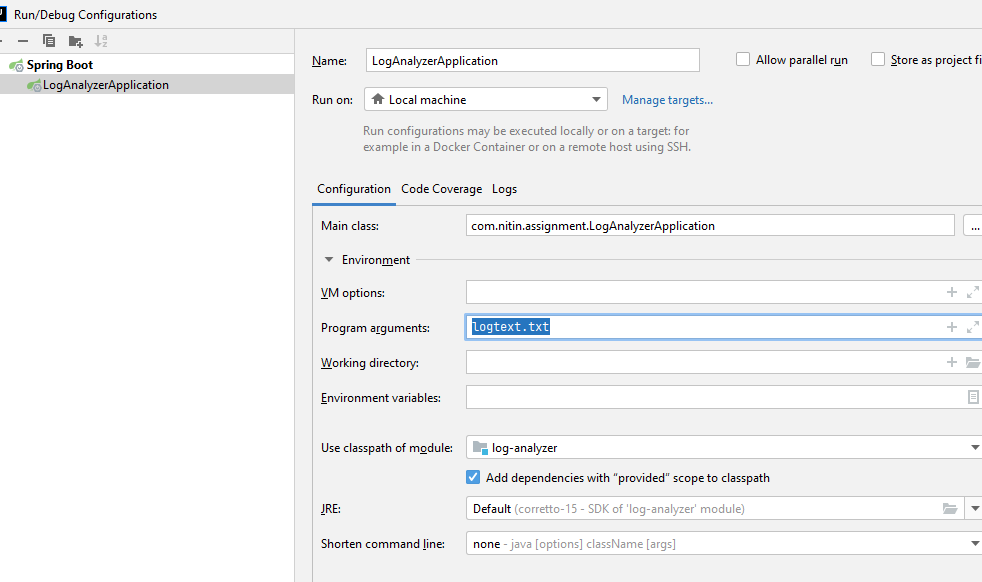
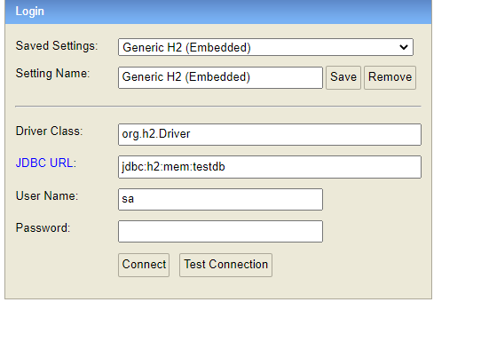
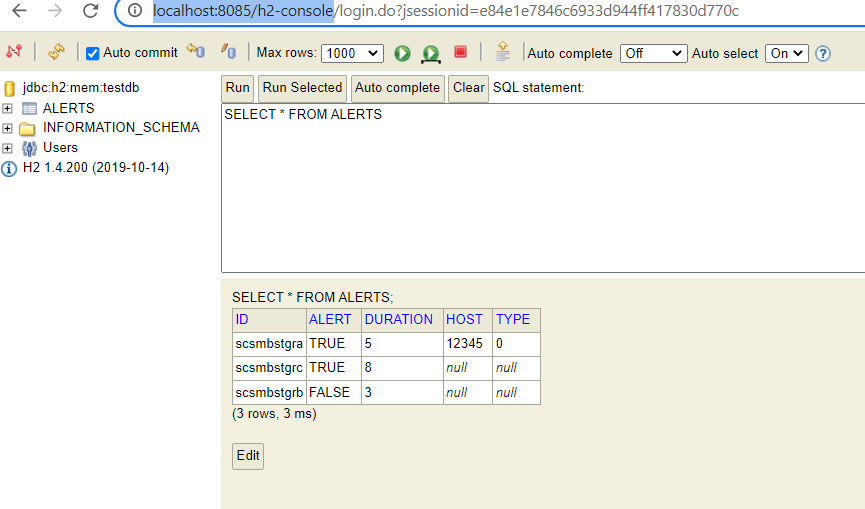

# Assignment 

## Summary of task

**Requirements for this coding assignment:**
- Java 8 or 11
- Use of any open-source library is allowed
- Your program must use either the Gradle or Maven build system to resolve dependencies, build and test

Our custom-build server logs different events to a file named logfile.txt. Every event has **2** entries in
the file - one entry when the event was started and another when the event was finished. The entries
in the file have no specific order (a finish event could occur before a start event for a given id).

Every line in the file is a JSON object containing the following event data:

* **id** - the unique event identifier
* **state** - whether the event was started or finished (can have values `STARTED` or `FINISHED`)
* **timestamp** - the timestamp of the event in milliseconds

Application Server logs also have the following additional attributes:
* **type** - type of log
* **host** - hostname

Example contents of logfile.txt:
```text
{"id":"scsmbstgra", "state":"STARTED", "type":"APPLICATI ON_LOG", "host":"12345",
"timestamp":1491377495212}
{"id":"scsmbstgrb", "state":"STARTED", "timestamp":1491377495213}
{"id":"scsmbstgrc", "state":"FINISHED", "timestamp":1491377495218}
{"id":"scsmbstgra", "state":"FINISHED", "type":"APPLICATION_LOG", "host":"12345",
"timestamp":1491377495217}
{"id":"scsmbstgrc", "state":"STARTED", "timestamp":1491377495210}
{"id":"scsmbstgrb", "state":"FINISHED", "timestamp":1491377495216}
...
```
In the example above, the event `scsmbstgrb` duration is `1491377495216 - 1491377495213 = 3ms`.
The longest event is `scsmbstgrc` (`1491377495218 - 1491377495210 = 8ms`).

**The program should:**
* Take the path to logfile.txt as an input argument
* Parse the contents of logfile.txt
* Flag any long events that take longer than 4ms
* Write the found event details to file-based HSQLDB (http://hsqldb.org/) in the working folder
* The application should create a new table if necessary and store the following values:
    * Event id
    * Event duration
    * Type and Host if applicable
    * Alert (true if the event took longer than 4ms, otherwise false)

## Solution:

- git clone https://github.com/sample-projects-only/log-analyzer-assignment.git
- import via intellij IDE
- provide `logtext.txt` as arguments


- run application via console. 
- console logs:

```text
2022-03-15 01:02:22.408  INFO 19872 --- [           main] c.n.assignment.LogAnalyzerApplication    : Started LogAnalyzerApplication in 2.985 seconds (JVM running for 3.615)
2022-03-15 01:02:22.408  INFO 19872 --- [           main] c.n.a.validator.LogAnalyserValidator     : Validating the input...
2022-03-15 01:02:22.408  INFO 19872 --- [           main] c.n.a.validator.LogAnalyserValidator     : Log file specified for LogAnalyserService: logtext.txt
2022-03-15 01:02:22.408  INFO 19872 --- [           main] c.n.a.manager.LogAnalyserManager         : Parsing the events and persisting the alerts. This may take a while...
Hibernate: select alert0_.id as id1_0_0_, alert0_.alert as alert2_0_0_, alert0_.duration as duration3_0_0_, alert0_.host as host4_0_0_, alert0_.type as type5_0_0_ from alerts alert0_ where alert0_.id=?
Hibernate: insert into alerts (alert, duration, host, type, id) values (?, ?, ?, ?, ?)
Hibernate: select alert0_.id as id1_0_0_, alert0_.alert as alert2_0_0_, alert0_.duration as duration3_0_0_, alert0_.host as host4_0_0_, alert0_.type as type5_0_0_ from alerts alert0_ where alert0_.id=?
Hibernate: insert into alerts (alert, duration, host, type, id) values (?, ?, ?, ?, ?)
Hibernate: select alert0_.id as id1_0_0_, alert0_.alert as alert2_0_0_, alert0_.duration as duration3_0_0_, alert0_.host as host4_0_0_, alert0_.type as type5_0_0_ from alerts alert0_ where alert0_.id=?
Hibernate: insert into alerts (alert, duration, host, type, id) values (?, ?, ?, ?, ?)
2022-03-15 01:02:22.549  INFO 19872 --- [           main] c.n.assignment.LogAnalyzerApplication    : Total time: 141ms
```

- database output - http://localhost:8085/h2-console
- connection string:
- 
- 
